Smart-PERKEMI — System Flow & Functional Flow
Dokumen flow sistem berdasarkan prototype Smart-PERKEMI | AI Video Analysis.
Fokus utama: Video Pertandingan → AI Video Analysis → Athlete Analysis → Opponent Analysis → Point Opportunity → AI Match Strategy → Coach Report → Match History.

1. Product Overview
Smart-PERKEMI adalah platform AI Performance Intelligence untuk membantu pelatih/analis memahami performa atlet melalui video pertandingan.
Konsep utama:
VIDEO
  ↓
UNDERSTAND
  ↓
MEASURE
  ↓
DETECT
  ↓
COMPARE
  ↓
PREDICT
  ↓
RECOMMEND
  ↓
COACH DECISION
  ↓
TRAIN
  ↓
IMPROVE
AI berfungsi sebagai Decision Support, bukan sebagai pengambil keputusan akhir pertandingan.
2. Main System Flow
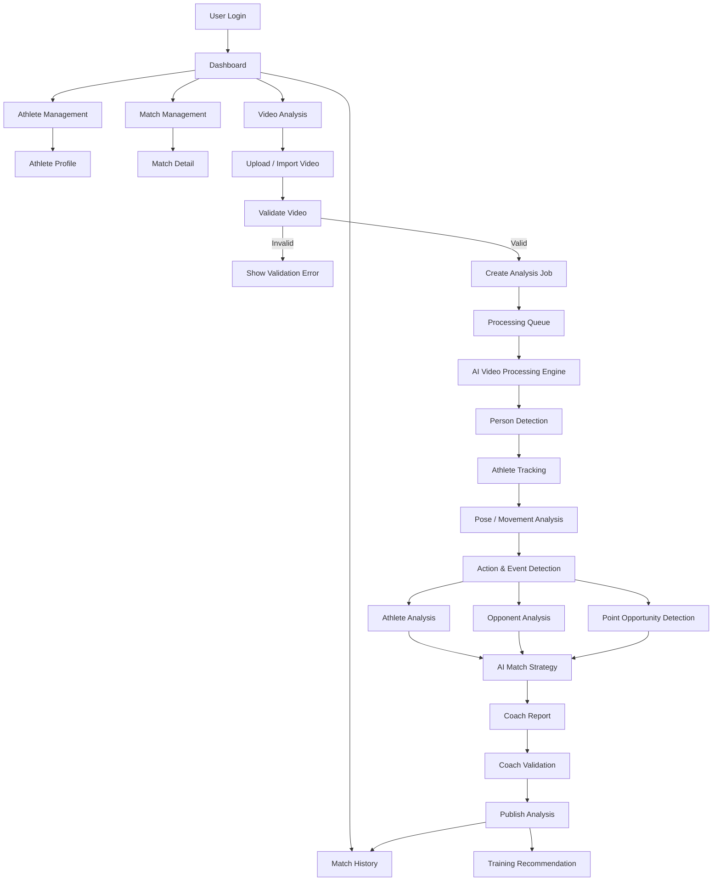
```mermaid
flowchart TD
    A[User Login] --> B[Dashboard]

    B --> C[Athlete Management]
    B --> D[Match Management]
    B --> E[Video Analysis]
    B --> F[Match History]

    C --> G[Athlete Profile]
    D --> H[Match Detail]

    E --> I[Upload / Import Video]
    I --> J[Validate Video]
    J -->|Invalid| K[Show Validation Error]
    J -->|Valid| L[Create Analysis Job]

    L --> M[Processing Queue]
    M --> N[AI Video Processing Engine]

    N --> O[Person Detection]
    O --> P[Athlete Tracking]
    P --> Q[Pose / Movement Analysis]
    Q --> R[Action & Event Detection]

    R --> S[Athlete Analysis]
    R --> T[Opponent Analysis]
    R --> U[Point Opportunity Detection]

    S --> V[AI Match Strategy]
    T --> V
    U --> V

    V --> W[Coach Report]
    W --> X[Coach Validation]
    X --> Y[Publish Analysis]

    Y --> F
    Y --> Z[Training Recommendation]
```
3. User Roles
3.1 Super Admin
Responsibilities:
- Manage users
- Manage roles and permissions
- Manage system configuration
- Manage AI model versions
- Monitor processing jobs
- Audit system activity
3.2 Admin / Binpres
Responsibilities:
- Manage athletes
- Manage coaches
- Manage clubs
- Manage events
- Manage matches
- View analysis
- View reports
3.3 Coach / Pelatih
Responsibilities:
- Select athlete
- Review match
- Upload/import video
- Review athlete performance
- Review opponent scouting
- Review point opportunities
- Generate AI strategy
- Validate AI findings
- Create coach report
- Review training priorities
3.4 Athlete
Responsibilities:
- View own performance
- View match history
- View strengths
- View weaknesses
- View training recommendations
3.5 Performance Analyst
Responsibilities:
- Review AI analysis
- Validate events
- Correct false detections
- Review confidence scores
- Assist coach with analysis
4. Main Navigation Flow
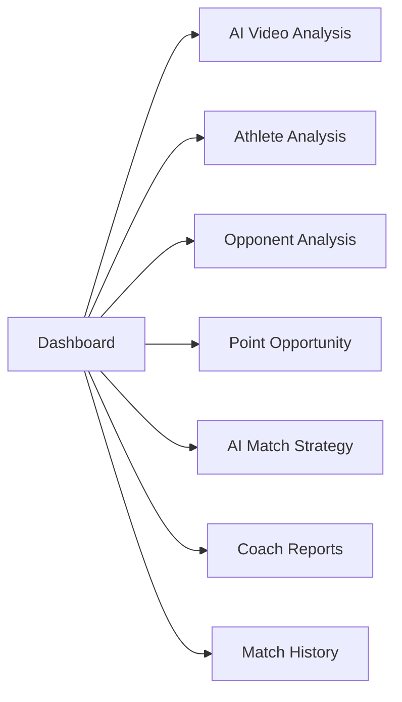
```mermaid
flowchart LR
    A[Dashboard] --> B[AI Video Analysis]
    A --> C[Athlete Analysis]
    A --> D[Opponent Analysis]
    A --> E[Point Opportunity]
    A --> F[AI Match Strategy]
    A --> G[Coach Reports]
    A --> H[Match History]
```
Main prototype modules:
1. AI Video Analysis
2. Athlete Analysis
3. Opponent Analysis
4. Point Opportunity
5. AI Match Strategy
6. Coach Reports
7. Match History
5. Dashboard Flow
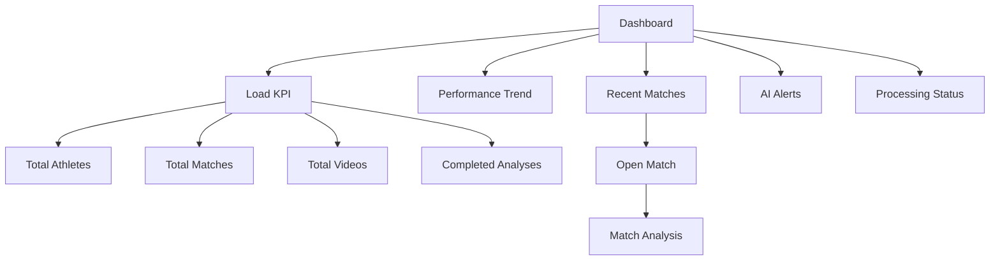
```mermaid
flowchart TD
    A[Dashboard] --> B[Load KPI]
    B --> C[Total Athletes]
    B --> D[Total Matches]
    B --> E[Total Videos]
    B --> F[Completed Analyses]

    A --> G[Performance Trend]
    A --> H[Recent Matches]
    A --> I[AI Alerts]
    A --> J[Processing Status]

    H --> K[Open Match]
    K --> L[Match Analysis]
```
Dashboard metrics:
- Total athletes
- Total matches
- Total videos
- Completed analysis
- Pending analysis
- Failed analysis
- Average performance score
- Recent matches
- AI alerts
- Performance trend
6. Athlete Management Flow
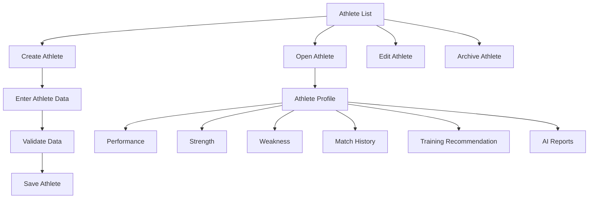
```mermaid
flowchart TD
    A[Athlete List] --> B[Create Athlete]
    A --> C[Open Athlete]
    A --> D[Edit Athlete]
    A --> E[Archive Athlete]

    B --> F[Enter Athlete Data]
    F --> G[Validate Data]
    G --> H[Save Athlete]

    C --> I[Athlete Profile]
    I --> J[Performance]
    I --> K[Strength]
    I --> L[Weakness]
    I --> M[Match History]
    I --> N[Training Recommendation]
    I --> O[AI Reports]
```
Athlete master data:
Athlete
├── ID
├── NIK / Identifier
├── Name
├── Gender
├── Date of Birth
├── Category
├── Club
├── Coach
├── Weight Class
├── Experience
├── Status
└── Profile Photo
7. Match Management Flow
Match menjadi entitas utama sebelum video dianalisis.
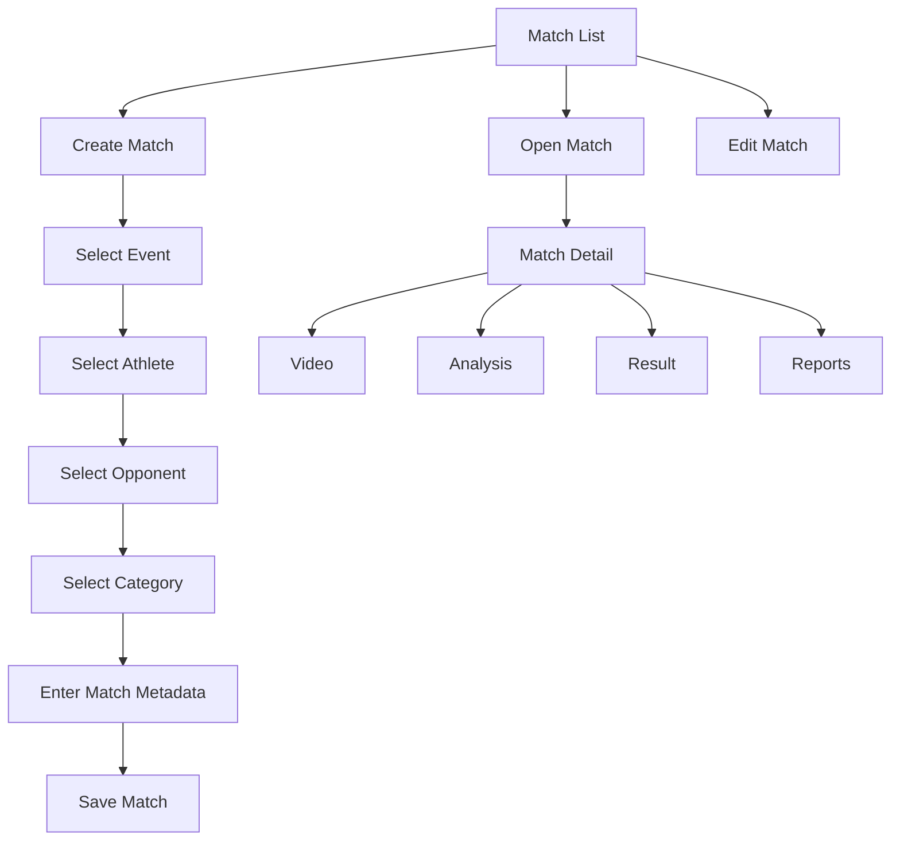
```mermaid
flowchart TD
    A[Match List] --> B[Create Match]
    A --> C[Open Match]
    A --> D[Edit Match]

    B --> E[Select Event]
    E --> F[Select Athlete]
    F --> G[Select Opponent]
    G --> H[Select Category]
    H --> I[Enter Match Metadata]
    I --> J[Save Match]

    C --> K[Match Detail]
    K --> L[Video]
    K --> M[Analysis]
    K --> N[Result]
    K --> O[Reports]
```
Match data:
Match
├── Event
├── Date
├── Venue
├── Category
├── Athlete
├── Opponent
├── Match Type
├── Result
├── Score
├── Video
├── Analysis Status
└── AI Report
8. Video Analysis Flow
8.1 Input
Video dapat berasal dari:
- Upload file
- YouTube URL
- Storage internal
- Storage eksternal yang didukung sistem
Prototype saat ini menggunakan URL YouTube sebagai input utama.
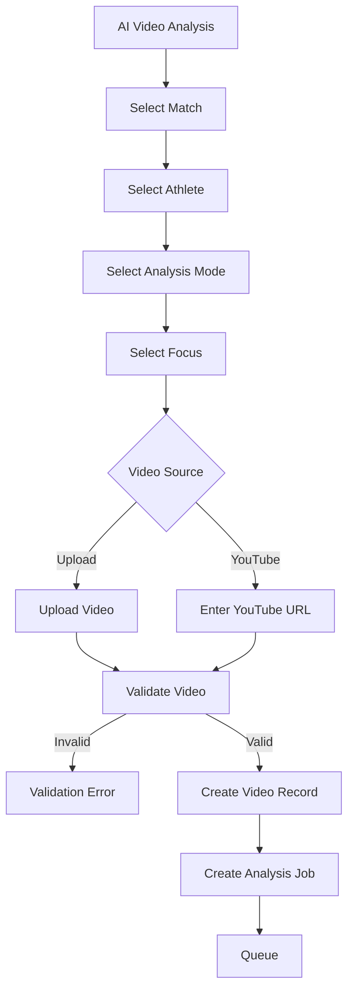
```mermaid
flowchart TD
    A[AI Video Analysis] --> B[Select Match]
    B --> C[Select Athlete]
    C --> D[Select Analysis Mode]
    D --> E[Select Focus]
    E --> F{Video Source}

    F -->|Upload| G[Upload Video]
    F -->|YouTube| H[Enter YouTube URL]

    G --> I[Validate Video]
    H --> I

    I -->|Invalid| J[Validation Error]
    I -->|Valid| K[Create Video Record]
    K --> L[Create Analysis Job]
    L --> M[Queue]
```
Analysis mode prototype:
Randori
Embu Perorangan
Embu Pasangan
Embu Beregu
Focus:
Atlet Merah
Atlet Biru
Keduanya
9. Video Processing Pipeline
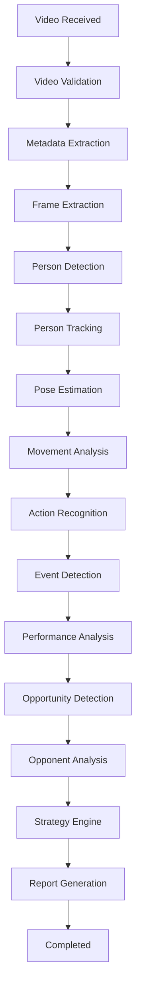
```mermaid
flowchart TD
    A[Video Received] --> B[Video Validation]
    B --> C[Metadata Extraction]
    C --> D[Frame Extraction]
    D --> E[Person Detection]
    E --> F[Person Tracking]
    F --> G[Pose Estimation]
    G --> H[Movement Analysis]
    H --> I[Action Recognition]
    I --> J[Event Detection]
    J --> K[Performance Analysis]
    K --> L[Opportunity Detection]
    L --> M[Opponent Analysis]
    M --> N[Strategy Engine]
    N --> O[Report Generation]
    O --> P[Completed]
```
10. Processing Status
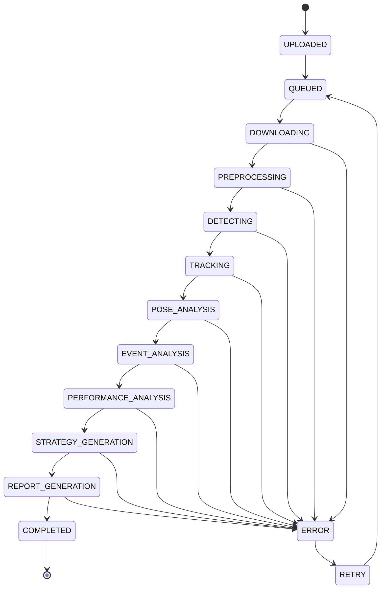
```mermaid
stateDiagram-v2
    [*] --> UPLOADED
    UPLOADED --> QUEUED
    QUEUED --> DOWNLOADING
    DOWNLOADING --> PREPROCESSING
    PREPROCESSING --> DETECTING
    DETECTING --> TRACKING
    TRACKING --> POSE_ANALYSIS
    POSE_ANALYSIS --> EVENT_ANALYSIS
    EVENT_ANALYSIS --> PERFORMANCE_ANALYSIS
    PERFORMANCE_ANALYSIS --> STRATEGY_GENERATION
    STRATEGY_GENERATION --> REPORT_GENERATION
    REPORT_GENERATION --> COMPLETED

    DOWNLOADING --> ERROR
    PREPROCESSING --> ERROR
    DETECTING --> ERROR
    TRACKING --> ERROR
    POSE_ANALYSIS --> ERROR
    EVENT_ANALYSIS --> ERROR
    PERFORMANCE_ANALYSIS --> ERROR
    STRATEGY_GENERATION --> ERROR
    REPORT_GENERATION --> ERROR

    ERROR --> RETRY
    RETRY --> QUEUED

    COMPLETED --> [*]
```

Status:
UPLOADED
QUEUED
DOWNLOADING
PREPROCESSING
DETECTING
TRACKING
POSE_ANALYSIS
EVENT_ANALYSIS
PERFORMANCE_ANALYSIS
STRATEGY_GENERATION
REPORT_GENERATION
COMPLETED
ERROR
CANCELLED
11. AI Computer Vision Flow
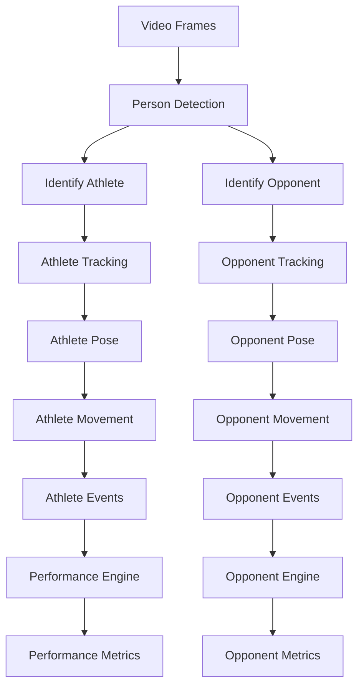
```mermaid
flowchart TD
    A[Video Frames] --> B[Person Detection]
    B --> C[Identify Athlete]
    B --> D[Identify Opponent]

    C --> E[Athlete Tracking]
    D --> F[Opponent Tracking]

    E --> G[Athlete Pose]
    F --> H[Opponent Pose]

    G --> I[Athlete Movement]
    H --> J[Opponent Movement]

    I --> K[Athlete Events]
    J --> L[Opponent Events]

    K --> M[Performance Engine]
    L --> N[Opponent Engine]

    M --> O[Performance Metrics]
    N --> P[Opponent Metrics]
```
12. Athlete Analysis Flow
Athlete analysis mengukur performa atlet sendiri.
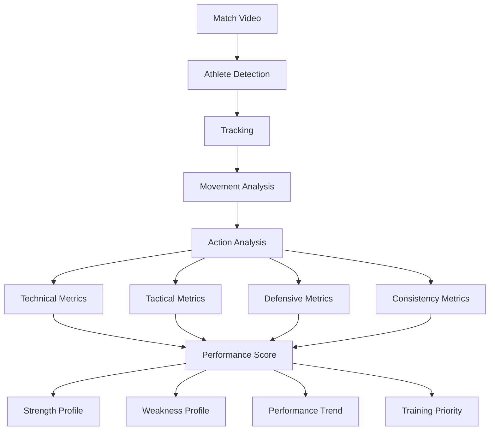
```mermaid
flowchart TD
    A[Match Video] --> B[Athlete Detection]
    B --> C[Tracking]
    C --> D[Movement Analysis]
    D --> E[Action Analysis]

    E --> F[Technical Metrics]
    E --> G[Tactical Metrics]
    E --> H[Defensive Metrics]
    E --> I[Consistency Metrics]

    F --> J[Performance Score]
    G --> J
    H --> J
    I --> J

    J --> K[Strength Profile]
    J --> L[Weakness Profile]
    J --> M[Performance Trend]
    J --> N[Training Priority]
```
Metrics
Technical
Timing
Attack
Counter
Guard
Footwork
Balance
Tactical
Initiative
Ma-ai Control
Distance Control
Tempo
Angle
Pressure
Decision Making
Defensive
Guard
Recovery
Retreat
Evade
Positioning
Consistency
First Round
Middle Round
Final Round
Overall
13. Strength & Weakness Flow
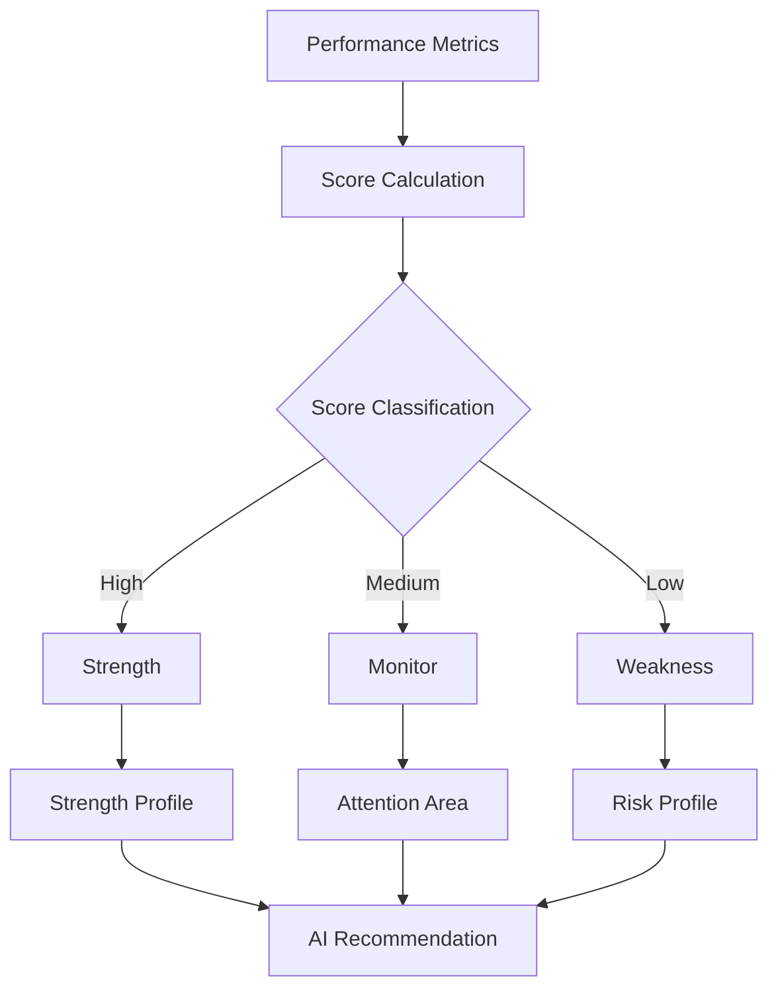
```mermaid
flowchart TD
    A[Performance Metrics] --> B[Score Calculation]
    B --> C{Score Classification}

    C -->|High| D[Strength]
    C -->|Medium| E[Monitor]
    C -->|Low| F[Weakness]

    D --> G[Strength Profile]
    E --> H[Attention Area]
    F --> I[Risk Profile]

    G --> J[AI Recommendation]
    H --> J
    I --> J
```
Output:
Strength
├── Timing
├── Ma-ai
├── Counter
└── Footwork

Weakness
├── Recovery
├── Guard
└── Predictable Entry
14. Opponent Analysis Flow
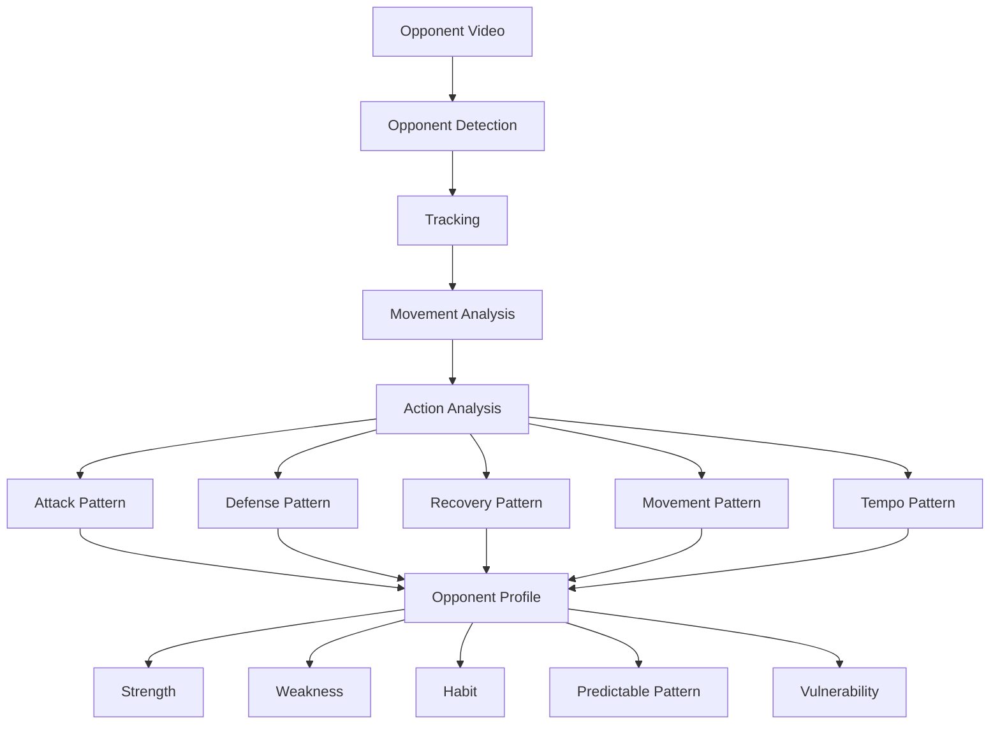
```mermaid
flowchart TD
    A[Opponent Video] --> B[Opponent Detection]
    B --> C[Tracking]
    C --> D[Movement Analysis]
    D --> E[Action Analysis]

    E --> F[Attack Pattern]
    E --> G[Defense Pattern]
    E --> H[Recovery Pattern]
    E --> I[Movement Pattern]
    E --> J[Tempo Pattern]

    F --> K[Opponent Profile]
    G --> K
    H --> K
    I --> K
    J --> K

    K --> L[Strength]
    K --> M[Weakness]
    K --> N[Habit]
    K --> O[Predictable Pattern]
    K --> P[Vulnerability]
```
15. Opponent Scouting
Yang dianalisis:
Area	Detection	Output
Attack Pattern	Direction, frequency, combination, tempo	Entry tendency
Defense	Guard, retreat, evade	Defensive gap
Recovery	Time to return	Counter window
Movement	Footwork and direction	Angle / pressure
Tempo	Rhythm and pause	Tempo opportunity

16. Point Opportunity Detection
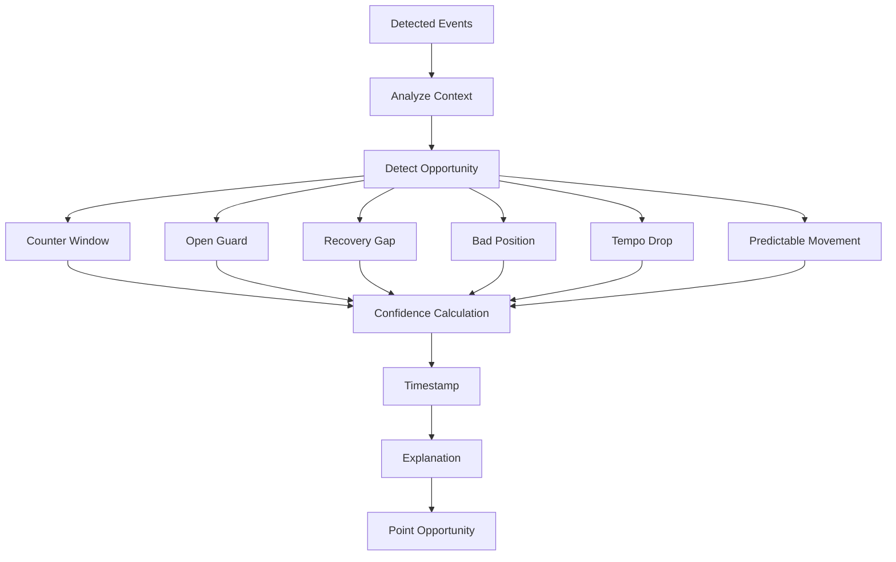
```mermaid
flowchart TD
    A[Detected Events] --> B[Analyze Context]
    B --> C[Detect Opportunity]

    C --> D[Counter Window]
    C --> E[Open Guard]
    C --> F[Recovery Gap]
    C --> G[Bad Position]
    C --> H[Tempo Drop]
    C --> I[Predictable Movement]

    D --> J[Confidence Calculation]
    E --> J
    F --> J
    G --> J
    H --> J
    I --> J

    J --> K[Timestamp]
    K --> L[Explanation]
    L --> M[Point Opportunity]
```
Output:
Timestamp
Confidence
Opportunity Type
Trigger
Explanation
Recommended Action
Evidence
Example:
01:06
91%
Counter Window

Recovery lawan terlambat setelah entry.
17. Coach Review Point Opportunity
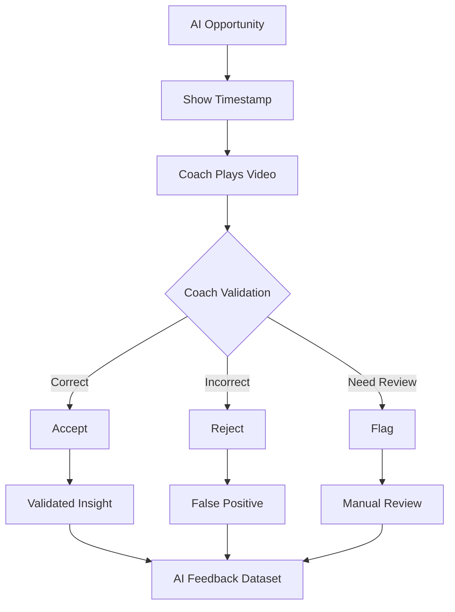
```mermaid
flowchart TD
    A[AI Opportunity] --> B[Show Timestamp]
    B --> C[Coach Plays Video]
    C --> D{Coach Validation}

    D -->|Correct| E[Accept]
    D -->|Incorrect| F[Reject]
    D -->|Need Review| G[Flag]

    E --> H[Validated Insight]
    F --> I[False Positive]
    G --> J[Manual Review]

    H --> K[AI Feedback Dataset]
    I --> K
    J --> K
```
18. AI Match Strategy Flow
AI Strategy menggabungkan:
Athlete Strength
+
Athlete Weakness
+
Opponent Strength
+
Opponent Weakness
+
Point Opportunities
+
Match Pattern
+
Historical Performance
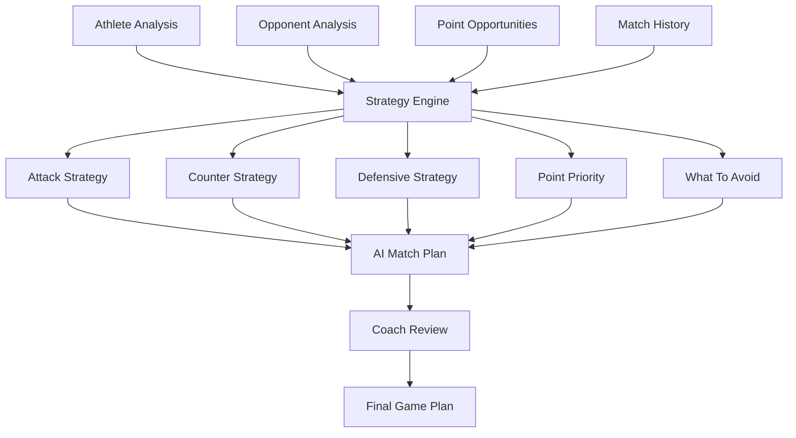
```mermaid
flowchart TD
    A[Athlete Analysis] --> E[Strategy Engine]
    B[Opponent Analysis] --> E
    C[Point Opportunities] --> E
    D[Match History] --> E

    E --> F[Attack Strategy]
    E --> G[Counter Strategy]
    E --> H[Defensive Strategy]
    E --> I[Point Priority]
    E --> J[What To Avoid]

    F --> K[AI Match Plan]
    G --> K
    H --> K
    I --> K
    J --> K

    K --> L[Coach Review]
    L --> M[Final Game Plan]
```
19. Strength × Opponent Weakness Matrix
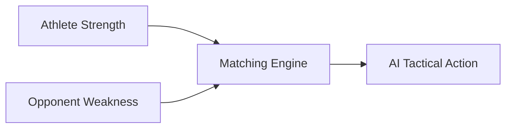
```mermaid
flowchart LR
    A[Athlete Strength] --> C[Matching Engine]
    B[Opponent Weakness] --> C

    C --> D[AI Tactical Action]
```
Example:
Timing 88
+
Opponent Recovery Slow
=
Counter After Entry

Ma-ai 84
+
Opponent Retreat Linear
=
Cut Angle / Lateral Pressure

Counter 86
+
Opponent Guard Reset Slow
=
Second Action Counter
20. Pre-Match Flow
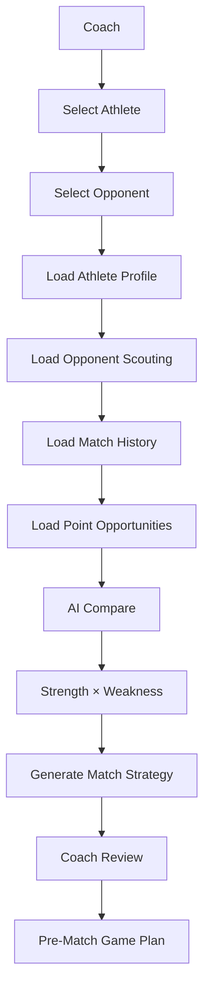
```mermaid
flowchart TD
    A[Coach] --> B[Select Athlete]
    B --> C[Select Opponent]
    C --> D[Load Athlete Profile]
    D --> E[Load Opponent Scouting]
    E --> F[Load Match History]
    F --> G[Load Point Opportunities]
    G --> H[AI Compare]
    H --> I[Strength × Weakness]
    I --> J[Generate Match Strategy]
    J --> K[Coach Review]
    K --> L[Pre-Match Game Plan]
```
Output:
PRE-MATCH GAME PLAN

1. Attack Priority
2. Counter Priority
3. Defensive Priority
4. Point Opportunities
5. What To Avoid
6. Key Triggers
21. Post-Match Flow
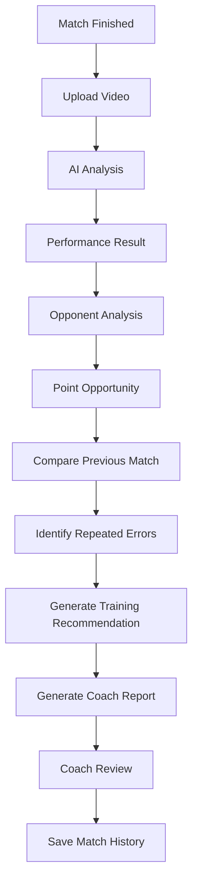
```mermaid
flowchart TD
    A[Match Finished] --> B[Upload Video]
    B --> C[AI Analysis]
    C --> D[Performance Result]
    D --> E[Opponent Analysis]
    E --> F[Point Opportunity]
    F --> G[Compare Previous Match]
    G --> H[Identify Repeated Errors]
    H --> I[Generate Training Recommendation]
    I --> J[Generate Coach Report]
    J --> K[Coach Review]
    K --> L[Save Match History]
```

22. Coach Report Flow
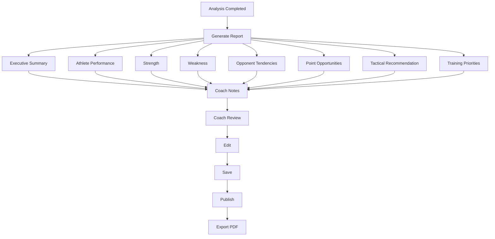
```mermaid
flowchart TD
    A[Analysis Completed] --> B[Generate Report]

    B --> C[Executive Summary]
    B --> D[Athlete Performance]
    B --> E[Strength]
    B --> F[Weakness]
    B --> G[Opponent Tendencies]
    B --> H[Point Opportunities]
    B --> I[Tactical Recommendation]
    B --> J[Training Priorities]

    C --> K[Coach Notes]
    D --> K
    E --> K
    F --> K
    G --> K
    H --> K
    I --> K
    J --> K

    K --> L[Coach Review]
    L --> M[Edit]
    M --> N[Save]
    N --> O[Publish]
    O --> P[Export PDF]
```

23. Coach Report Structure
SMART-PERKEMI
MATCH PERFORMANCE REPORT

1. Executive Summary

2. Match Overview

3. Athlete Performance
   - Overall Score
   - Technical
   - Tactical
   - Defensive
   - Consistency

4. Strength Analysis

5. Weakness & Risk

6. Opponent Analysis

7. Point Opportunities
   - Timestamp
   - Confidence
   - Opportunity
   - Evidence

8. AI Match Strategy

9. Training Priorities

10. Coach Notes

11. AI Confidence

12. Model Version
24. Training Recommendation Flow
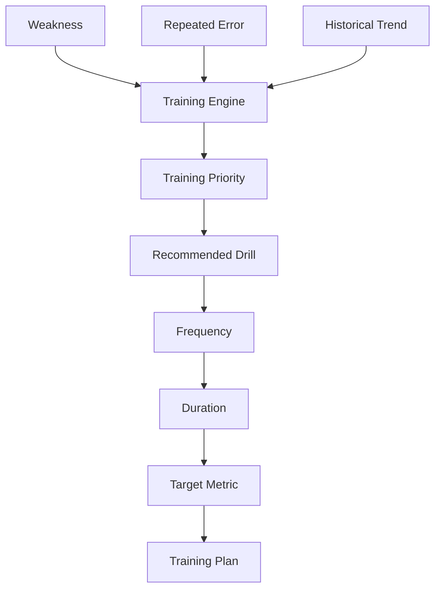
```mermaid
flowchart TD
    A[Weakness] --> D[Training Engine]
    B[Repeated Error] --> D
    C[Historical Trend] --> D

    D --> E[Training Priority]
    E --> F[Recommended Drill]
    F --> G[Frequency]
    G --> H[Duration]
    H --> I[Target Metric]

    I --> J[Training Plan]
```
Example:
Priority:
Recovery & Guard Reset

Drill:
Lateral Recovery Drill

Frequency:
3x / Week

Duration:
15 Minutes

Target:
Recovery Score > 80
25. Match History Flow
```mermaid
flowchart TD
    A[Match History] --> B[Select Athlete]
    B --> C[Load Matches]
    C --> D[Performance Comparison]

    D --> E[Timing Trend]
    D --> F[Counter Trend]
    D --> G[Recovery Trend]
    D --> H[Strength Trend]
    D --> I[Opportunity Trend]

    E --> J[Longitudinal Analysis]
    F --> J
    G --> J
    H --> J
    I --> J

    J --> K[Improvement]
    J --> L[Decline]
    J --> M[Repeated Weakness]
```
26. Longitudinal Performance
MATCH 01
Timing      72
Counter     68
Recovery    61

        ↓

MATCH 02
Timing      78
Counter     74
Recovery    65

        ↓

MATCH 03
Timing      82
Counter     81
Recovery    71

        ↓

MATCH 04
Timing      88
Counter     86
Recovery    79
AI kemudian dapat menghasilkan:
Improvement:
Timing +16
Counter +18
Recovery +18

Priority:
Recovery still needs improvement.
27. AI Confidence Flow
Setiap hasil AI sebaiknya memiliki:
Prediction
Confidence
Timestamp
Evidence
Model Version
Validation Status
```mermaid
flowchart TD
    A[AI Prediction] --> B[Confidence Score]
    B --> C{Confidence}

    C -->|>= 85%| D[High Confidence]
    C -->|75-84%| E[Medium Confidence]
    C -->|< 75%| F[Low Confidence]

    D --> G[Recommended Review]
    E --> H[Coach Review]
    F --> I[Manual Review]
```
28. Human-in-the-Loop
AI tidak boleh dianggap selalu benar.
```mermaid
flowchart TD
    A[AI Result] --> B[Coach / Analyst Review]

    B --> C{Result}

    C -->|Correct| D[Accept]
    C -->|Incorrect| E[Reject]
    C -->|Needs Adjustment| F[Edit]

    D --> G[Validated Data]
    E --> H[False Positive]
    F --> I[Corrected Data]

    G --> J[Feedback Dataset]
    H --> J
    I --> J
```
Feedback dapat digunakan untuk evaluasi model dan pengembangan AI berikutnya.
29. Full End-to-End Flow
```mermaid
flowchart TD
    START([Start]) --> LOGIN[Login]
    LOGIN --> DASH[Dashboard]

    DASH --> ATH[Athlete Management]
    DASH --> MATCH[Match Management]
    DASH --> ANALYSIS[AI Video Analysis]
    DASH --> HISTORY[Match History]

    ATH --> ATHLETE[Athlete Profile]

    MATCH --> MATCHDETAIL[Match Detail]
    MATCHDETAIL --> VIDEO[Upload / Import Video]

    ANALYSIS --> VIDEO
    VIDEO --> VALIDATE{Validate Video}

    VALIDATE -->|Invalid| ERROR[Show Error]
    VALIDATE -->|Valid| JOB[Create Analysis Job]

    JOB --> QUEUE[Processing Queue]
    QUEUE --> INGEST[Video Ingestion]
    INGEST --> PREPROCESS[Preprocessing]
    PREPROCESS --> DETECT[Person Detection]
    DETECT --> TRACK[Tracking]
    TRACK --> POSE[Pose / Movement]
    POSE --> EVENTS[Action / Event Detection]

    EVENTS --> ATHANALYSIS[Athlete Analysis]
    EVENTS --> OPPANALYSIS[Opponent Analysis]
    EVENTS --> OPPORTUNITY[Point Opportunity]

    ATHANALYSIS --> STRATEGY[AI Match Strategy]
    OPPANALYSIS --> STRATEGY
    OPPORTUNITY --> STRATEGY
    HISTORY --> STRATEGY

    STRATEGY --> REPORT[Coach Report]
    REPORT --> REVIEW[Coach Validation]

    REVIEW -->|Revise| REPORT
    REVIEW -->|Approve| PUBLISH[Publish Analysis]

    PUBLISH --> TRAIN[Training Recommendation]
    PUBLISH --> HISTORY

    TRAIN --> END([Complete])
```

30. Data Flow
```mermaid
flowchart LR
    USER[Coach / Analyst] --> WEB[Web Application]

    WEB --> API[Laravel Backend]

    API --> DB[(PostgreSQL)]
    API --> REDIS[(Redis Queue)]
    API --> STORAGE[(Video Storage)]

    REDIS --> WORKER[Python AI Worker]

    STORAGE --> WORKER

    WORKER --> FFMPEG[FFmpeg]
    WORKER --> CV[Computer Vision]
    WORKER --> POSE[Pose Estimation]
    WORKER --> TRACK[Tracking]
    WORKER --> EVENT[Event Detection]

    EVENT --> RESULT[Analysis Result]

    RESULT --> DB

    DB --> API
    API --> WEB
```

31. Recommended Technical Architecture
SMART-PERKEMI
│
├── Laravel Application
│   ├── Authentication
│   ├── Authorization
│   ├── Athlete
│   ├── Coach
│   ├── Club
│   ├── Event
│   ├── Match
│   ├── Video
│   ├── Analysis
│   ├── Reports
│   └── History
│
├── React + TypeScript
│   ├── Dashboard
│   ├── Video Player
│   ├── Timeline
│   ├── Analytics
│   ├── Strategy
│   └── Reports
│
├── Redis
│   └── Queue / Job
│
├── Python AI Engine
│   ├── Video Processor
│   ├── Detection
│   ├── Tracking
│   ├── Pose
│   ├── Action Recognition
│   ├── Event Detection
│   ├── Performance Engine
│   └── Strategy Engine
│
├── PostgreSQL
│   ├── Master Data
│   ├── Match Data
│   ├── Analysis
│   ├── Metrics
│   ├── Events
│   └── Reports
│
└── Storage
    ├── Original Video
    ├── Processed Video
    ├── Frames
    ├── Evidence Clips
    └── Reports
32. Suggested Database Domain
users
roles
permissions

athletes
coaches
clubs
events

matches
match_participants
match_results

videos
video_processing_jobs

analyses
analysis_metrics
analysis_events

athlete_metrics
opponent_metrics

point_opportunities

strategies
strategy_recommendations

coach_reports
training_recommendations

ai_models
ai_model_versions

audit_logs
33. Analysis Entity Relationship
```mermaid
erDiagram
    ATHLETES ||--o{ MATCHES : participates
    MATCHES ||--o{ VIDEOS : contains
    VIDEOS ||--o{ ANALYSES : generates

    ANALYSES ||--o{ ANALYSIS_EVENTS : contains
    ANALYSES ||--o{ ANALYSIS_METRICS : contains
    ANALYSES ||--o{ POINT_OPPORTUNITIES : detects

    ATHLETES ||--o{ ATHLETE_METRICS : has
    MATCHES ||--o{ OPPONENT_METRICS : produces

    ANALYSES ||--o{ STRATEGIES : generates
    STRATEGIES ||--o{ STRATEGY_RECOMMENDATIONS : contains

    ANALYSES ||--o{ COACH_REPORTS : produces
    ANALYSES ||--o{ TRAINING_RECOMMENDATIONS : produces
```
34. MVP Scope
Phase 1 — Core MVP
Authentication
Athlete Management
Coach Management
Event Management
Match Management
Video Upload
YouTube Import
Video Player
Processing Queue
Basic AI Analysis
Athlete Analysis
Opponent Analysis
Point Opportunity
AI Match Strategy
Coach Report
Match History
Phase 2 — Advanced Intelligence
Pose Estimation
Advanced Tracking
Advanced Event Detection
Performance Trend
Training Recommendation
Coach Validation
AI Feedback Loop
Evidence Clips
Phase 3 — Advanced Platform
Multi-camera Analysis
Real-time Analysis
Advanced Tactical Engine
Federation Dashboard
Athlete Ranking
Competition Analytics
Advanced Model Management
Model Training / Evaluation
35. Important Production Rules
AI
AI result harus menyimpan:
model_version
confidence
timestamp
evidence
prediction
validation_status
Video
Video harus memiliki:
original_file
processed_file
duration
resolution
fps
codec
file_size
storage_path
processing_status
Processing
Jangan melakukan video analysis langsung dalam HTTP request.
Gunakan:
Laravel
   ↓
Queue
   ↓
Python Worker
   ↓
AI Processing
   ↓
Result
Failure Handling
Setiap job harus memiliki:
status
progress
started_at
completed_at
failed_at
error_message
retry_count
Audit
Perubahan penting harus dapat dilacak:
who
what
when
before
after
36. Final Product Flow
                    SMART-PERKEMI
                          │
          ┌───────────────┴───────────────┐
          │                               │
       PRE-MATCH                       POST-MATCH
          │                               │
          ▼                               ▼
   Athlete Profile                   Match Video
          │                               │
          ▼                               ▼
   Opponent Scouting                AI Processing
          │                               │
          ▼                               ▼
   Historical Data                 Event Detection
          │                               │
          └───────────────┬───────────────┘
                          ▼
                  PERFORMANCE ENGINE
                          │
            ┌─────────────┼─────────────┐
            ▼             ▼             ▼
         Athlete       Opponent      Opportunity
         Analysis      Analysis       Detection
            │             │             │
            └─────────────┼─────────────┘
                          ▼
                   AI STRATEGY ENGINE
                          │
             ┌────────────┼────────────┐
             ▼            ▼            ▼
           Attack       Counter      Defense
             │            │            │
             └────────────┼────────────┘
                          ▼
                    COACH REPORT
                          │
                ┌─────────┴─────────┐
                ▼                   ▼
             Game Plan        Training Plan
                │                   │
                └─────────┬─────────┘
                          ▼
                   MATCH HISTORY
                          │
                          ▼
                  LONGITUDINAL AI
                          │
                          ▼
                 PERFORMANCE TREND
                          │
                          └──────► IMPROVEMENT
37. Product Principle
Smart-PERKEMI harus mengikuti prinsip:
AI detects
    ↓
AI explains
    ↓
AI recommends
    ↓
Coach validates
    ↓
Coach decides
    ↓
Athlete trains
    ↓
Performance improves
    ↓
New match data
    ↓
AI learns / is evaluated
AI bukan pengganti pelatih.
AI menjadi:
Performance Intelligence & Decision Support System for Coaches.

38. Recommended Development Order
1. Authentication & RBAC
        ↓
2. Athlete / Coach / Club
        ↓
3. Event & Match Management
        ↓
4. Video Management
        ↓
5. Video Processing Queue
        ↓
6. Python AI Worker
        ↓
7. Detection & Tracking
        ↓
8. Event Detection
        ↓
9. Athlete Analysis
        ↓
10. Opponent Analysis
        ↓
11. Point Opportunity
        ↓
12. AI Strategy
        ↓
13. Coach Report
        ↓
14. Match History
        ↓
15. Training Recommendation
        ↓
16. Coach Validation
        ↓
17. AI Feedback Loop
39. Definition of Done — MVP
MVP dianggap siap apabila:
- [ ] User dapat login
- [ ] Admin dapat membuat athlete
- [ ] Admin dapat membuat coach
- [ ] Admin dapat membuat event
- [ ] Coach dapat membuat match
- [ ] Coach dapat upload video
- [ ] Sistem dapat melakukan validasi video
- [ ] Video masuk processing queue
- [ ] Python worker dapat mengambil job
- [ ] Video dapat diproses
- [ ] Athlete dapat dideteksi
- [ ] Opponent dapat dideteksi
- [ ] Event pertandingan dapat dibuat
- [ ] Athlete performance dapat dihitung
- [ ] Opponent pattern dapat dihitung
- [ ] Point opportunity dapat dibuat
- [ ] Confidence score tersedia
- [ ] Timestamp tersedia
- [ ] Coach dapat review evidence
- [ ] AI strategy dapat dibuat
- [ ] Coach report dapat dibuat
- [ ] Report dapat diedit
- [ ] Report dapat disimpan
- [ ] Report dapat diekspor
- [ ] Match masuk history
- [ ] Performance dapat dibandingkan antar match
- [ ] Error processing dapat di-retry
- [ ] Semua hasil AI menyimpan model version
- [ ] Audit log tersedia
40. Reference
Dokumen ini menggunakan prototype Smart-PERKEMI | AI Video Analysis sebagai baseline kebutuhan dan struktur modul.
Prototype saat ini secara eksplisit menunjukkan menu AI Video Analysis, Athlete Analysis, Opponent Analysis, Point Opportunity, AI Match Strategy, Coach Reports, dan Match History, serta menyatakan bahwa computer vision belum terhubung dan data prototype masih berupa simulasi.